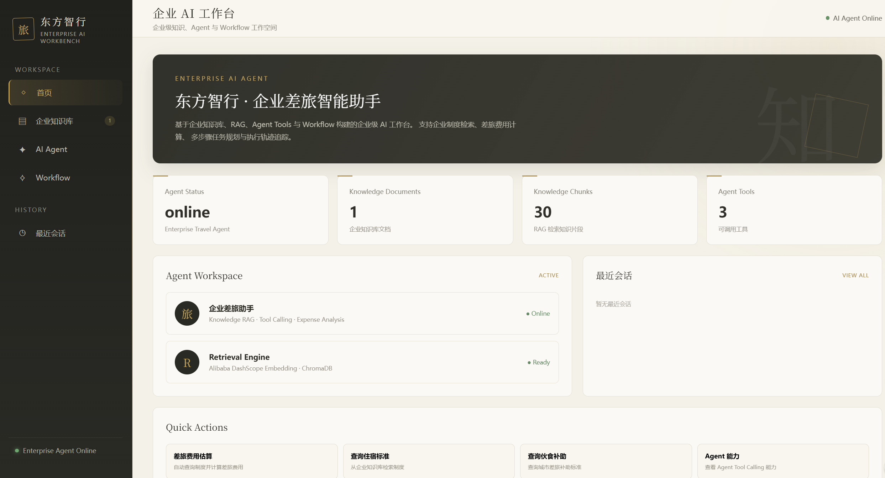
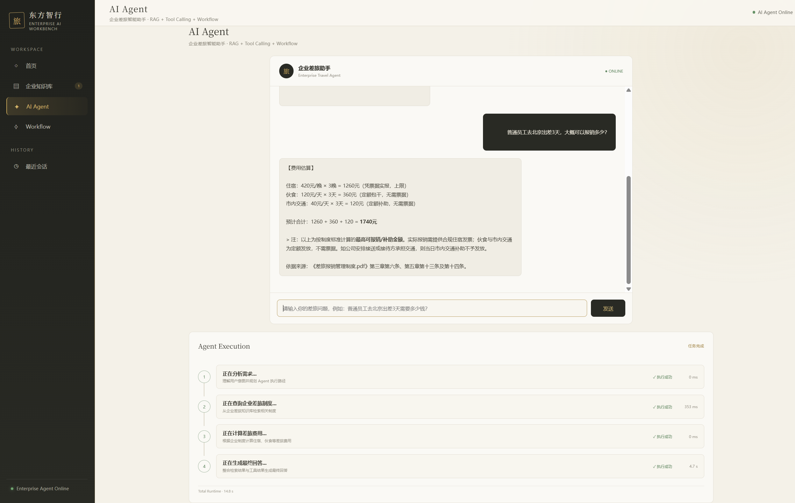

# Enterprise AI Workbench

> 企业级 AI Agent 工作台 —— 基于 RAG、LLM、Agent 与 Tool Calling 构建的企业智能应用原型

一个面向企业场景设计的 AI Workbench，集成 **Enterprise Knowledge Base、AI Agent、Tool Calling、Workflow 与 Conversation** 等能力。

当前以 **Enterprise Travel Assistant（企业差旅助手）** 为核心 Agent 场景，实现企业差旅制度问答、知识库检索、费用计算及多步骤任务处理。

---

## 📸 Project Preview

### Enterprise AI Workbench

> 企业级 AI 工作台界面，包含 Dashboard、Knowledge Base、AI Agent、Workflow 与 Conversation 等模块。



### Enterprise Travel Assistant

> 基于企业差旅制度知识库，为员工提供差旅政策查询与费用计算。




---

# 🎯 Project Overview

传统企业软件中的制度、流程和业务规则通常分散在 PDF、Excel、ERP、OA 等系统中。

员工在实际工作中经常需要：

* 查询企业制度
* 查找费用标准
* 判断某项费用是否符合规定
* 计算差旅费用
* 根据多个条件综合判断

本项目尝试构建一个统一的 **Enterprise AI Workbench**，让企业用户通过自然语言直接与企业知识和业务能力交互。

当前以企业差旅场景作为 MVP：

```text
Employee
   ↓
Natural Language Query
   ↓
Enterprise AI Agent
   ↓
Task Understanding
   ↓
┌───────────────────────┐
│ Knowledge Search      │
│ Calculator            │
│ Travel Expense Logic  │
└───────────────────────┘
   ↓
RAG + Tool Calling
   ↓
Qwen LLM
   ↓
Structured Answer
   ↓
Source Citation
```

---

# ✨ Core Features

## 1. Enterprise Dashboard

提供企业 AI 工作台首页，用于统一展示 AI 能力和业务入口。

当前工作台包含：

* Dashboard
* Knowledge Base
* AI Agent
* Workflow
* Recent Conversations

采用企业软件工作台形式进行产品化设计，并结合东方视觉元素进行 UI 设计。

---

## 2. Enterprise Knowledge Base

基于企业制度文档构建 RAG Knowledge Base。

当前知识库主要使用：

**《差旅报销管理制度》**

支持：

* PDF 文档解析
* 文本切分
* Chunk 构建
* Embedding
* Vector Database
* Semantic Retrieval
* Retrieval Result Filtering
* Source Citation

知识处理流程：

```text
PDF
 ↓
Text Extraction
 ↓
Document Chunking
 ↓
Embedding
 ↓
ChromaDB
 ↓
Semantic Search
 ↓
Relevant Context
```

---

## 3. RAG-based Question Answering

用户可以通过自然语言查询企业制度。

例如：

> 普通员工去北京出差，住宿标准是多少？

系统会：

1. 分析用户问题
2. 检索企业知识库
3. 找到相关制度条款
4. 将检索结果提供给 LLM
5. 生成最终答案
6. 返回对应知识来源

示例：

```text
用户：
普通员工去北京出差，住宿标准是多少？

AI：
普通员工在北京出差的住宿标准为 420 元/晚。

参考来源：
差旅报销管理制度.pdf · 第六条
```

---

# 🤖 Enterprise AI Agent

项目不仅实现简单的 RAG 问答，还进一步将知识库封装为 Agent Tool，使 Agent 可以根据用户任务决定是否调用工具。

当前 Agent 支持：

### Knowledge Search Tool

用于查询企业知识库。

```text
User Question
      ↓
Agent
      ↓
Knowledge Search
      ↓
RAG Retrieval
      ↓
Relevant Policy
```

---

### Calculator Tool

用于执行费用计算。

例如：

```text
420 × 3
```

Agent 可以调用计算工具获得准确结果，而不是完全依赖 LLM 进行数学计算。

---

### Travel Expense Analysis

针对企业差旅场景，对住宿、伙食补助等费用进行综合计算。

例如：

> 普通员工去北京出差 3 天，大概可以报销多少？

Agent 可以结合：

* 住宿标准
* 伙食补助
* 出差天数

进行计算。

示例：

```text
住宿：
420 × 3 = 1260 元

伙食：
120 × 3 = 360 元

预计合计：
1620 元
```

---

# 🧠 Agent Architecture

当前 Agent 采用 Tool Calling + Agent Loop 的方式实现。

```text
                    User
                     │
                     ▼
              ┌─────────────┐
              │ AI Agent    │
              └──────┬──────┘
                     │
              Task Understanding
                     │
          ┌──────────┼──────────┐
          ▼          ▼          ▼
     Knowledge     Calculator   Travel
       Search         Tool      Analysis
          │            │           │
          ▼            ▼           ▼
       ChromaDB     Calculation   Business
          │                        Logic
          └──────────┬─────────────┘
                     ▼
                  Qwen LLM
                     │
                     ▼
              Final Response
                     │
                     ▼
              Source Citation
```

Agent 不只是简单地：

```text
Question → LLM → Answer
```

而是：

```text
Question
   ↓
Agent
   ↓
Determine Required Action
   ↓
Select Tool
   ↓
Execute Tool
   ↓
Obtain Result
   ↓
Continue Reasoning
   ↓
Generate Final Answer
```

---

# 📚 RAG Architecture

项目使用 Alibaba Cloud DashScope 的 Embedding Model：

```text
text-embedding-v4
```

向量数据库：

```text
ChromaDB
```

当前 Embedding Dimension：

```text
1024
```

完整流程：

```text
                    Knowledge Document
                           │
                           ▼
                      PDF Parser
                           │
                           ▼
                    Text Chunking
                           │
                           ▼
                    text-embedding-v4
                           │
                           ▼
                       ChromaDB
                           │
                           │
User Question              │
      │                    │
      ▼                    │
Question Embedding         │
      │                    │
      └──────────► Semantic Search
                           │
                           ▼
                    Relevant Chunks
                           │
                           ▼
                     Context Builder
                           │
                           ▼
                       Qwen LLM
                           │
                           ▼
                       AI Answer
```

---

# 🛠️ Technology Stack

| Layer           | Technology                      |
| --------------- | ------------------------------- |
| Frontend        | HTML / CSS / JavaScript         |
| Backend         | Python / Flask                  |
| LLM             | Qwen                            |
| Embedding       | Alibaba Cloud text-embedding-v4 |
| RAG             | Custom RAG Pipeline             |
| Vector Database | ChromaDB                        |
| PDF Processing  | PyPDF                           |
| Agent           | Python Agent Loop               |
| API             | OpenAI-compatible API           |
| Environment     | Python Virtual Environment      |

---

# 📁 Project Structure

```text
AI_Workbench/
│
├── app.py
│
├── agent.py
├── rag.py
├── retrieve.py
├── build_knowledge_base.py
├── read_pdf.py
│
├── knowledge/
│   └── 差旅报销管理制度.pdf
│
├── chroma_db/
│
├── static/
│   ├── css/
│   │   └── style.css
│   │
│   └── js/
│       └── app.js
│
├── templates/
│   └── index.html
│
├── .env
├── .gitignore
├── requirements.txt
└── README.md
```


---

# 🔍 Example Use Cases

## Case 1 — Policy Question

```text
用户：
普通员工在北京出差，住宿标准是多少？

Agent：
普通员工在北京出差的住宿标准为 420 元/晚。

参考来源：
差旅报销管理制度.pdf · 第六条
```

---

## Case 2 — Multi-step Expense Calculation

```text
用户：
普通员工去北京出差 3 天，大概可以报销多少？

Agent：

住宿：
420 × 3 = 1260 元

伙食补助：
120 × 3 = 360 元

预计合计：
1620 元
```

Agent 在此过程中需要同时完成：

```text
Policy Retrieval
        +
Parameter Extraction
        +
Calculation
        ↓
Final Answer
```

---

# 🧩 Product Design

本项目以企业 AI 产品为设计目标，将企业知识库、RAG、AI Agent、Tool Calling 与业务场景结合，构建面向企业业务任务的 AI 应用原型。

整体产品结构：

```text
Enterprise AI Workbench
│
├── Dashboard
│
├── Knowledge Base
│   └── Enterprise Documents
│
├── AI Agent
│   └── Enterprise Travel Assistant
│
├── Workflow
│
└── Conversations
```

核心设计思路：

> 将企业知识、AI Agent 和业务工具统一放入一个工作台中，使 AI 从单纯的“问答机器人”逐渐转变为能够理解业务任务并调用企业能力的智能工作助手。

---

# 🎨 UI Design

项目采用企业级工作台布局，并融入东方视觉设计元素。

主要界面包括：

* Dashboard
* Knowledge Base
* AI Agent
* Workflow
* Conversation

设计目标：

```text
Enterprise Software
        +
AI Native Interaction
        +
Oriental Visual Language
```

在保持企业软件信息层级和操作效率的基础上，通过色彩、纹理和视觉元素增加产品识别度。

---

# 💡 Project Highlights

## 1. From RAG to Agent

项目从最初的企业知识库问答进一步升级为 Agent：

```text
RAG
 ↓
Tool
 ↓
Agent
 ↓
Task Execution
```

---

## 2. Enterprise Scenario Driven

不是为了展示 LLM 而使用 LLM，而是围绕真实企业业务场景设计：

```text
Enterprise Policy
        ↓
Knowledge Base
        ↓
AI Agent
        ↓
Business Tools
        ↓
Business Decision Support
```

---

## 3. Grounded Answering

Agent 优先使用企业知识库中的真实制度信息。

对于知识库中不存在的信息，不应直接编造企业政策。

这种设计用于降低企业场景中的：

* Hallucination
* Policy Misinterpretation
* Unsupported Answers

---

## 4. Tool-based AI

通过 Tool Calling 将 LLM 与确定性工具连接：

```text
LLM
 │
 ├── Knowledge Search
 │
 ├── Calculator
 │
 └── Business Logic
```

让 AI 不仅能够生成文本，也能够执行实际任务。

---

# 🚀 Future Roadmap

后续可以继续扩展：

### Knowledge

* 多企业知识库
* Word / Excel / PDF 多格式支持
* Knowledge Base Management
* Document Version Management
* Retrieval Evaluation

### Agent

* 更多企业 Agent
* Agent Memory
* Multi-Agent Collaboration
* Agent Evaluation
* Permission Control

### Workflow

* Visual Workflow Builder
* Approval Workflow
* Automated Expense Review
* Enterprise Process Automation

### Enterprise

* User Authentication
* Role-Based Access Control
* Multi-tenant Architecture
* Operation Logs
* Agent Monitoring
* Usage Analytics

---

# 📌 Project Positioning

本项目定位为一个：

> **Enterprise AI Application Prototype**

重点探索：

**RAG + Agent + Tools + Enterprise Workflow**

而不是单纯的大模型聊天应用。

项目同时覆盖：

```text
Business Understanding
        +
Product Design
        +
AI Application Development
        +
Enterprise Software
```

---

# 👩‍💻 Author

Independent AI Product & Application Development Project

Focused on:

* AI Product
* AI Agent
* Enterprise AI
* RAG
* Business Intelligence
* Enterprise Software

---

# ⭐ Summary

**Enterprise AI Workbench** 是一个面向企业业务场景设计的 AI Agent 工作台。

当前以 **企业差旅助手**作为 MVP，通过：

```text
Enterprise Knowledge Base
        +
RAG
        +
LLM
        +
Agent
        +
Tool Calling
```

实现企业制度查询与差旅费用分析。

项目的最终目标不是构建一个简单的聊天机器人，而是探索：

> **如何将企业知识、业务规则和 AI Agent 结合，构建真正能够辅助企业员工完成业务任务的 AI 工作台。**
